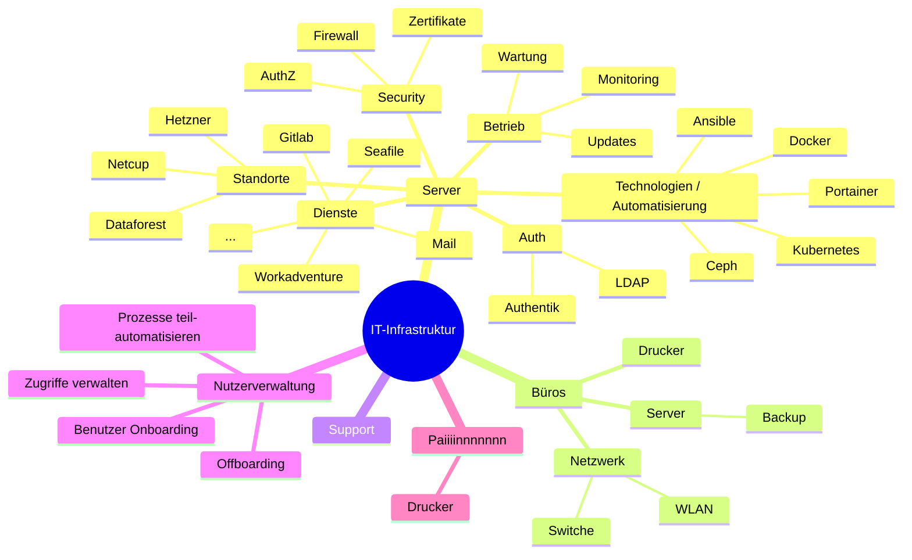

# IT-Infrastruktur Mindmap

## Alternative Darstellung (HTML/Markdown)

### IT-Infrastruktur
- **Server**
  - **Standorte**
    - Netcup
    - Dataforest
    - Hetzner
  - **Technologien / Automatisierung**
    - Ansible
    - Docker
    - Portainer
    - Kubernetes
    - Ceph
  - **Dienste**
    - Gitlab
    - Mail
    - Seafile
    - Workadventure
    - ...
  - **Betrieb**
    - Wartung
    - Monitoring
    - Updates
  - **Security**
    - Zertifikate
    - Firewall
    - AuthZ
  - **Auth**
    - LDAP
    - Authentik
- **Büros**
  - **Netzwerk**
    - Switche
    - WLAN
  - **Server**
    - Backup
  - **Drucker**
- **Support**
- **Nutzerverwaltung**
  - Benutzer Onboarding
  - Zugriffe verwalten
  - Offboarding
  - Prozesse teil-automatisieren *bzw. hinter der Automatisierung hinterherlaufen und von Hand aufräumen*
- **Paiiiinnnnnnn**
  - Drucker

